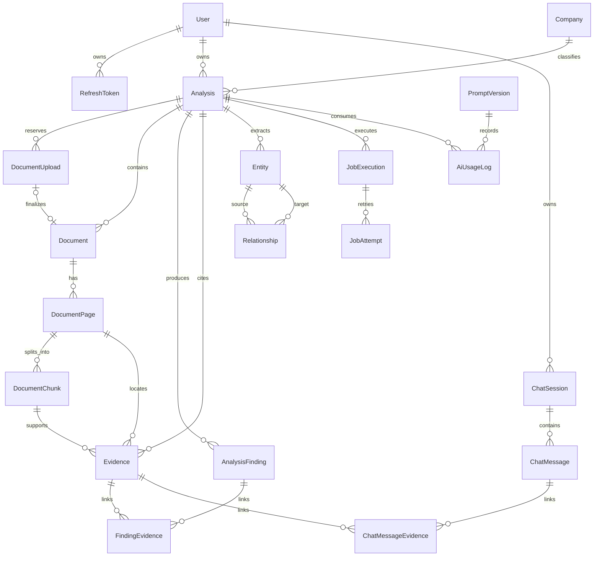

# StockLens AI データベース設計

## 1. 目的

この文書は、StockLens AI の Phase 2 以降で使用する PostgreSQL / Prisma の論理データモデルを定義します。実装前に、次の要件を設計として固定することが目的です。

- ユーザー単位のデータ分離
- PDF、ページ、Chunk、Evidence の追跡可能性
- 非同期 Job の再試行と冪等性
- 構造化 AI 出力と Prompt Version の監査可能性
- pgvector と PostgreSQL Full Text Search を使用する将来の Hybrid Retrieval
- Soft Delete と個人データ削除への対応

この文書の承認後に `prisma/schema.prisma` と最初の Migration を作成します。

## 2. 設計原則

### 2.1 ID と日時

- Primary Key は Application 側で生成する UUID を使用します。
- すべての Table に `createdAt` と `updatedAt` を持たせます。
- User が削除できる Resource には `deletedAt` を持たせます。
- 時刻は PostgreSQL の `timestamptz` として UTC で保存し、表示時に Timezone を適用します。

### 2.2 ユーザー所有権

`Company` と `PromptVersion` は System-wide Reference Data とします。それ以外のユーザーデータには、原則として `ownerId` または `userId` を直接保持します。

- Repository のすべての User-owned Resource Query は `ownerId` を条件に含めます。
- URL や Request Body で受け取った Resource ID だけで検索しません。
- Child Record にも `ownerId` を保持し、深い Join に依存しない認可を可能にします。
- `ownerId` は作成後に変更できません。
- 作成時は Parent Resource と同じ `ownerId` であることを Transaction 内で検証し、対応可能な Parent/Child には Composite Foreign Key も設定します。

PostgreSQL Row Level Security は MVP では必須とせず、Repository 層と Authorization Test で保証します。将来 RLS を追加できるよう、User-owned Table に Ownership Column を揃えます。

### 2.3 JSONB と Relational Data

次を JSONB として保存します。

- `Analysis` の三つの View Output
- Deterministic Code で算出した Financial Metric の Snapshot
- LLM Provider の非機密 Metadata
- Job Error の構造化された Detail

次は検索、整合性、Evidence Traceability のため Relational に保持します。

- Document、DocumentPage、DocumentChunk
- AnalysisFinding、Evidence とその Link
- JobExecution
- PromptVersion、AiUsageLog
- Entity、Relationship
- ChatSession、ChatMessage

### 2.4 機密情報

- Password は Password Hash のみ保存します。
- Refresh Token は平文では保存せず、Hash のみ保存します。
- PDF 本文全体、Prompt 全体、Access Token、Refresh Token、API Key を Log や `AiUsageLog` に保存しません。
- Object Storage には Private Bucket を使用し、Database には Bucket と Object Key を保存します。長期 Presigned URL は保存しません。

## 3. Entity Relationship



## 4. Core Table

### 4.1 User

認証主体です。

| Column            | Type                 | Constraint / Purpose         |
| ----------------- | -------------------- | ---------------------------- |
| `id`              | UUID                 | Primary Key                  |
| `email`           | Text                 | Login 用。正規化後の値を保存 |
| `passwordHash`    | Text                 | Argon2id などで生成した Hash |
| `displayName`     | Text nullable        | 表示名                       |
| `isDemo`          | Boolean              | Demo User の識別             |
| `emailVerifiedAt` | Timestamptz nullable | 将来の Email Verification 用 |
| `lastLoginAt`     | Timestamptz nullable | Security Audit 用            |
| `createdAt`       | Timestamptz          | 作成日時                     |
| `updatedAt`       | Timestamptz          | 更新日時                     |
| `deletedAt`       | Timestamptz nullable | Account Soft Delete          |

Email は Application で trim と lowercase を行い、`email` に Unique Index を設定します。Soft-deleted User の Email 再利用方針は Phase 2 の Auth 実装前に決定します。MVP では再利用不可を Default とします。

### 4.2 RefreshToken

Refresh Token Rotation と Reuse Detection を支えます。

| Column              | Type                 | Constraint / Purpose             |
| ------------------- | -------------------- | -------------------------------- |
| `id`                | UUID                 | Primary Key                      |
| `userId`            | UUID                 | `User.id`                        |
| `tokenHash`         | Text                 | Unique。平文 Token は保存しない  |
| `familyId`          | UUID                 | Token Family 単位の失効          |
| `expiresAt`         | Timestamptz          | 有効期限                         |
| `revokedAt`         | Timestamptz nullable | 失効日時                         |
| `replacedByTokenId` | UUID nullable        | Rotation 後の Token              |
| `lastUsedAt`        | Timestamptz nullable | Reuse Detection                  |
| `userAgentHash`     | Text nullable        | 生の User-Agent を避けた補助情報 |
| `createdAt`         | Timestamptz          | 作成日時                         |
| `updatedAt`         | Timestamptz          | 更新日時                         |

`userId, familyId` と `expiresAt` に Index を設定します。

### 4.3 Company

日本の上場企業を表す System-wide Reference Data です。User のアップロード内容や分析結果は含めません。

| Column       | Type          | Constraint / Purpose |
| ------------ | ------------- | -------------------- |
| `id`         | UUID          | Primary Key          |
| `nameJa`     | Text          | 日本語社名           |
| `nameEn`     | Text nullable | 英語社名             |
| `ticker`     | Text nullable | 証券コード           |
| `exchange`   | Text nullable | 取引所 / Market      |
| `edinetCode` | Text nullable | EDINET Code          |
| `createdAt`  | Timestamptz   | 作成日時             |
| `updatedAt`  | Timestamptz   | 更新日時             |

`ticker, exchange` と `edinetCode` に Unique Index を設定します。企業を特定できない Upload に対応するため、`Analysis.companyId` は nullable とします。

### 4.4 Analysis

最大 3 件の Document をまとめて処理する分析 Unit です。

| Column                | Type                 | Constraint / Purpose               |
| --------------------- | -------------------- | ---------------------------------- |
| `id`                  | UUID                 | Primary Key                        |
| `ownerId`             | UUID                 | `User.id`、認可 Boundary           |
| `companyId`           | UUID nullable        | `Company.id`                       |
| `title`               | Text                 | History 表示用                     |
| `status`              | AnalysisStatus       | Async Status Machine               |
| `failureCode`         | Text nullable        | Stable Error Code                  |
| `failureMessage`      | Text nullable        | Sanitized Message                  |
| `justTellMeOutput`    | JSONB nullable       | Zod 検証済み Output                |
| `analystViewOutput`   | JSONB nullable       | Zod 検証済み Output                |
| `buffettMungerOutput` | JSONB nullable       | Zod 検証済み Output                |
| `financialMetrics`    | JSONB nullable       | Deterministic Calculation Snapshot |
| `completedAt`         | Timestamptz nullable | 完了日時                           |
| `createdAt`           | Timestamptz          | 作成日時                           |
| `updatedAt`           | Timestamptz          | 更新日時                           |
| `deletedAt`           | Timestamptz nullable | Soft Delete                        |

`ownerId, createdAt DESC`、`ownerId, status`、`companyId` に Index を設定します。`ownerId, id` は Owner-consistent Child Relation の Composite Candidate Key です。

AnalysisStatus は次に限定します。

```text
DRAFT
UPLOADED
PARSING
CHUNKING
EMBEDDING
EXTRACTING
VALIDATING
COMPLETED
FAILED_PARSING
FAILED_CHUNKING
FAILED_EMBEDDING
FAILED_EXTRACTION
FAILED_VALIDATION
```

新規 Analysis は `DRAFT` で作成し、最初の Document Finalize 後に `UPLOADED` へ遷移します。`DRAFT` 追加時の既存 Row は Data Migration せず、現在の Status を維持します。

### 4.5 Document

Upload された PDF の Metadata と Storage Location を保持します。

| Column          | Type                 | Constraint / Purpose         |
| --------------- | -------------------- | ---------------------------- |
| `id`            | UUID                 | Primary Key                  |
| `ownerId`       | UUID                 | `User.id`                    |
| `analysisId`    | UUID                 | `Analysis.id`                |
| `originalName`  | Text                 | Sanitized Original Filename  |
| `documentType`  | DocumentType         | 決算短信など。Unknown を許可 |
| `mimeType`      | Text                 | 検証済み MIME Type           |
| `sizeBytes`     | BigInt               | 最大 20 MB                   |
| `sha256`        | Text                 | Integrity と重複検知         |
| `storageBucket` | Text                 | Private Bucket               |
| `storageKey`    | Text                 | Unique Object Key            |
| `pageCount`     | Integer nullable     | Parse 完了後に設定           |
| `uploadedAt`    | Timestamptz nullable | Upload 完了日時              |
| `createdAt`     | Timestamptz          | 作成日時                     |
| `updatedAt`     | Timestamptz          | 更新日時                     |
| `deletedAt`     | Timestamptz nullable | Soft Delete                  |

`ownerId, analysisId`、`analysisId, createdAt`、`storageKey`、`ownerId, sha256` に Index を設定します。`Document(ownerId, analysisId)` は `Analysis(ownerId, id)` を参照する Composite FK により Cross-owner Parent Relation を拒否します。1 Analysis あたり最大 3 Document は Service の Transaction 内で検証します。Database Trigger は MVP では使用しません。

### 4.5.1 DocumentUpload

Direct Presigned Upload の発行から Trusted Finalize までを追跡する一時 Session です。不完全または不正な Object を `Document` として扱いません。

| Column                | Type                 | Constraint / Purpose                   |
| --------------------- | -------------------- | -------------------------------------- |
| `id`                  | UUID                 | Primary Key                            |
| `ownerId`             | UUID                 | `User.id`、認可 Boundary               |
| `analysisId`          | UUID                 | `Analysis.id`                          |
| `finalizedDocumentId` | UUID nullable        | Completed 時の Finalized `Document.id` |
| `originalName`        | Text                 | Client が宣言した Original Filename    |
| `documentType`        | DocumentType         | Client が宣言した Document Type        |
| `declaredMimeType`    | Text                 | Client が宣言した MIME Type            |
| `declaredSizeBytes`   | BigInt               | 1 byte 以上 20 MB 以下                 |
| `claimedSha256`       | Text                 | 64 文字 Lowercase Hex                  |
| `storageBucket`       | Text                 | Private Bucket                         |
| `storageKey`          | Text                 | Unique Random Object Key               |
| `status`              | DocumentUploadStatus | Upload/Validation Lifecycle            |
| `expiresAt`           | Timestamptz          | Orphan Cleanup 判定時刻                |
| `failureCode`         | Text nullable        | `REJECTED` 時の Stable Error           |
| `failureMessage`      | Text nullable        | Sanitized Failure Detail               |
| `completedAt`         | Timestamptz nullable | `COMPLETED` 時刻                       |
| `createdAt`           | Timestamptz          | 作成日時                               |
| `updatedAt`           | Timestamptz          | 更新日時                               |

`DocumentUploadStatus` は `PENDING`、`VALIDATING`、`COMPLETED`、`REJECTED`、`EXPIRED` に限定します。Database `CHECK` は Size、SHA-256、Expiry、必須 Metadata、Completion/Failure State の整合性を強制します。

`DocumentUpload(ownerId, analysisId)` は `Analysis(ownerId, id)`、`DocumentUpload(ownerId, analysisId, finalizedDocumentId)` は `Document(ownerId, analysisId, id)` を参照します。後者は Composite Unique Constraint を持ち、同じ Finalized Document を複数 Session が完了扱いにすることを拒否します。Cleanup Scan 用 `(status, expiresAt)`、Ownership/List 用 `(ownerId, analysisId, status)`、Duplicate Lookup 用 `(ownerId, analysisId, claimedSha256)` に Index を設定します。

Session と Active Document の合計最大 3 件、重複 SHA-256、Finalization Transaction は API/Repository の Serializable Transaction と限定 `P2034` Retry で実装します。Concurrent Start は最大 3 Reservation に収束します。同一 Session の Concurrent Finalize で `Document.storageKey` Unique Conflict が発生した場合は、先に完了した Session/Document を Owner Scope で再読込し、同じ Document を返します。Database Trigger は使用しません。

Session TTL は作成から 24 時間です。Worker は起動時と 60 秒ごとに `(status, expiresAt)` Index を使って期限切れ `PENDING` / `VALIDATING` Session を最大 100 件ずつ取得します。Status/Expiry 条件付き Update と Stable `OBJECT_CLEANUP` Upsert は Serializable Transaction 内で実行し、Finalize または別 Scanner が先に状態を確定した場合は何も作成しません。`EXPIRED` Session の再 Scan は Cleanup Execution を重複させません。

### 4.6 DocumentPage

PDF から抽出したページ単位の Text を保持します。OCR は行いません。

| Column            | Type           | Constraint / Purpose           |
| ----------------- | -------------- | ------------------------------ |
| `id`              | UUID           | Primary Key                    |
| `ownerId`         | UUID           | `User.id`                      |
| `documentId`      | UUID           | `Document.id`                  |
| `pageNumber`      | Integer        | 1 Origin の PDF Page Number    |
| `text`            | Text           | Extracted Text                 |
| `textSha256`      | Text           | Idempotency / Change Detection |
| `sectionMetadata` | JSONB nullable | 検出した見出しなど             |
| `createdAt`       | Timestamptz    | 作成日時                       |
| `updatedAt`       | Timestamptz    | 更新日時                       |

`documentId, pageNumber` に Unique Constraint、`ownerId, documentId` に Index を設定します。

### 4.7 DocumentChunk

Retrieval と LLM Context の最小 Unit です。

| Column           | Type                 | Constraint / Purpose                    |
| ---------------- | -------------------- | --------------------------------------- |
| `id`             | UUID                 | Primary Key                             |
| `ownerId`        | UUID                 | `User.id`                               |
| `documentId`     | UUID                 | `Document.id`                           |
| `pageId`         | UUID                 | Chunk 開始 Page。MVP は Page を跨がない |
| `chunkIndex`     | Integer              | Document 内の順序                       |
| `section`        | Text nullable        | 検出した Section 名                     |
| `content`        | Text                 | Chunk 本文                              |
| `contentSha256`  | Text                 | 冪等性 Key の一部                       |
| `tokenCount`     | Integer nullable     | Provider-independent Estimate           |
| `embedding`      | `vector(n)` nullable | Semantic Search 用                      |
| `embeddingModel` | Text nullable        | Dimension と Model の監査用             |
| `createdAt`      | Timestamptz          | 作成日時                                |
| `updatedAt`      | Timestamptz          | 更新日時                                |

`documentId, chunkIndex` に Unique Constraint を設定し、`documentId, contentSha256` には非 Unique Index を設定します。同一 PDF 内でも Header や Footer が同じ Text になる可能性があるため、Content Hash だけでは重複と判断しません。Full Text Search 用の generated `tsvector` Column と GIN Index、Embedding 用の HNSW Index は SQL Migration で追加します。

Embedding Dimension は Provider 選定後に固定し、Model / Dimension を変更する場合は新 Column または再 Embedding Migration として扱います。

### 4.8 AnalysisFinding

三つの View が参照する構造化された重要 Finding です。

| Column       | Type            | Constraint / Purpose             |
| ------------ | --------------- | -------------------------------- |
| `id`         | UUID            | Primary Key                      |
| `ownerId`    | UUID            | `User.id`                        |
| `analysisId` | UUID            | `Analysis.id`                    |
| `findingKey` | Text            | 再実行でも安定する Logical Key   |
| `category`   | FindingCategory | Positive、Risk、Uncertainty など |
| `title`      | Text            | 短い見出し                       |
| `body`       | Text            | Evidence-based Description       |
| `importance` | Integer         | UI Ordering。範囲を Zod で制約   |
| `status`     | FindingStatus   | Supported / InsufficientEvidence |
| `createdAt`  | Timestamptz     | 作成日時                         |
| `updatedAt`  | Timestamptz     | 更新日時                         |

`analysisId, findingKey` に Unique Constraint、`ownerId, analysisId` と `analysisId, category` に Index を設定します。Evidence がない重要判断は `SUPPORTED` にできません。

### 4.9 Evidence

原文まで追跡できる引用候補です。

| Column          | Type             | Constraint / Purpose   |
| --------------- | ---------------- | ---------------------- |
| `id`            | UUID             | Primary Key            |
| `ownerId`       | UUID             | `User.id`              |
| `analysisId`    | UUID             | `Analysis.id`          |
| `documentId`    | UUID             | `Document.id`          |
| `pageId`        | UUID             | `DocumentPage.id`      |
| `chunkId`       | UUID             | `DocumentChunk.id`     |
| `pageNumber`    | Integer          | UI 用 Snapshot         |
| `excerpt`       | Text             | Original Excerpt       |
| `excerptSha256` | Text             | 冪等性と重複検知       |
| `startOffset`   | Integer nullable | Page Text 内の開始位置 |
| `endOffset`     | Integer nullable | Page Text 内の終了位置 |
| `createdAt`     | Timestamptz      | 作成日時               |
| `updatedAt`     | Timestamptz      | 更新日時               |

`analysisId, documentId, pageNumber, excerptSha256` に Unique Constraint を設定します。`documentName` は `Document.originalName` を Join して API Response に含めます。

`FindingEvidence` は `ownerId` を持ち、`findingId, evidenceId` を Composite Primary Key とする Join Table です。`ChatMessageEvidence` も `ownerId` を持ち、同様に Evidence を再利用します。

### 4.10 Entity / Relationship

P1 の Lightweight Knowledge Graph です。Neo4j は使用しません。

`Entity` は `ownerId`、`analysisId`、`type`、`name`、`normalizedName`、`attributes JSONB` を持ちます。`analysisId, type, normalizedName` を Unique とします。

`Relationship` は `ownerId`、`analysisId`、`sourceEntityId`、`targetEntityId`、`type`、`attributes JSONB`、`evidenceId nullable` を持ちます。Source と Target は同一 Analysis / Owner に属することを Service と Integration Test で検証します。

### 4.11 ChatSession / ChatMessage

P1 の Ask This Company 用です。

- `ChatSession`: `ownerId`、`companyId nullable`、`analysisId nullable`、`title`、`createdAt`、`updatedAt`、`deletedAt`
- `ChatMessage`: `ownerId`、`sessionId`、`role`、`content`、`status`、`createdAt`、`updatedAt`

Anonymous Chat は作成しません。すべての Session と Message は User に所属します。Assistant Message の根拠は `ChatMessageEvidence` で関連付けます。

### 4.12 JobExecution

BullMQ Job の実行履歴と Step 単位の状態を保持します。

| Column             | Type                 | Constraint / Purpose               |
| ------------------ | -------------------- | ---------------------------------- |
| `id`               | UUID                 | Primary Key                        |
| `ownerId`          | UUID                 | `User.id`                          |
| `analysisId`       | UUID                 | `Analysis.id`                      |
| `documentId`       | UUID nullable        | Document Scope の Step 用          |
| `documentUploadId` | UUID nullable        | Incomplete Upload Cleanup Scope    |
| `step`             | JobStep              | PARSE、CHUNK、EMBED など           |
| `status`           | JobStatus            | QUEUED、RUNNING、SUCCEEDED、FAILED |
| `currentAttempt`   | Integer              | 最新の Attempt Number              |
| `idempotencyKey`   | Text                 | Unique                             |
| `startedAt`        | Timestamptz nullable | 開始日時                           |
| `finishedAt`       | Timestamptz nullable | 終了日時                           |
| `errorCode`        | Text nullable        | Stable Error Code                  |
| `errorMessage`     | Text nullable        | Sanitized Error                    |
| `errorDetails`     | JSONB nullable       | 非機密の構造化 Detail              |
| `createdAt`        | Timestamptz          | 作成日時                           |
| `updatedAt`        | Timestamptz          | 更新日時                           |

Analysis Pipeline の `idempotencyKey` は `analysisId:documentId-or-analysis:step:inputVersion` から生成する予定です。Object Cleanup は `object-cleanup:document:<documentId>:v1` または `object-cleanup:document-upload:<uploadId>:v1` を使用します。同一 Key の成功済み Job は派生 Record や Object Delete を再実行しません。

Object Cleanup は `step = OBJECT_CLEANUP` とし、`documentId` または `documentUploadId` のちょうど一方を Target にします。Database `CHECK` と Owner/Analysis Composite Foreign Key がこの条件を強制し、Worker は Relation から Private Storage Location を取得します。Queue Payload は `jobExecutionId` UUID だけで、Storage Location、Owner ID、Credential を保存しません。

各 Retry は `JobAttempt` に保存します。`JobAttempt` は `ownerId`、`jobExecutionId`、`attempt`、`bullmqJobId`、`status`、`startedAt`、`finishedAt`、失敗情報を持ち、`jobExecutionId, attempt` を Unique とします。Object Cleanup は最大 3 Attempt の Exponential Backoff で、Provider Detail を保存せず `OBJECT_STORAGE_DELETE_FAILED` と Sanitized Message だけを記録します。成功時は Execution と最後の Attempt を `SUCCEEDED` にし、Object が既に存在しない場合も成功扱いです。

### 4.13 PromptVersion

System-wide の Immutable Reference Data です。

| Column          | Type        | Constraint / Purpose        |
| --------------- | ----------- | --------------------------- |
| `id`            | UUID        | Primary Key                 |
| `name`          | Text        | Prompt の用途               |
| `version`       | Integer     | 単調増加 Version            |
| `template`      | Text        | System / Developer Template |
| `schemaVersion` | Text        | Output Schema Version       |
| `contentSha256` | Text        | Integrity                   |
| `isActive`      | Boolean     | 新規 Job の Default         |
| `createdAt`     | Timestamptz | 作成日時                    |
| `updatedAt`     | Timestamptz | Metadata 更新日時           |

`name, version` と `contentSha256` を Unique とします。利用済み Version の本文は更新せず、新 Version を作成します。

### 4.14 AiUsageLog

Cost、Latency、Model、Prompt Version を監査します。

- `ownerId`
- `analysisId nullable`
- `jobExecutionId nullable`
- `promptVersionId nullable`
- `provider`
- `model`
- `operation`
- `inputTokens nullable`
- `outputTokens nullable`
- `embeddingTokens nullable`
- `estimatedCostMicros nullable`
- `latencyMs`
- `requestId nullable`
- `providerRequestId nullable`
- `metadata JSONB nullable`
- `createdAt` / `updatedAt`

Prompt 本文、PDF 本文、API Credential、Provider Response 全体は保存しません。

## 5. Delete Policy

### 5.1 User 操作

- Document 削除は `deletedAt` を設定し、Object Storage 削除 Job を登録します。
- Analysis 削除は Analysis と所属 Document を非表示にし、派生データ削除 Job を登録します。
- Account 削除は User-owned Resource を利用不能にし、Retention Policy に従って非同期削除します。

### 5.2 Database Relation

- User-owned Root からの意図しない Cascade Delete は避けます。
- Page、Chunk、Finding、Evidence など再生成可能な Child は、明示的な Cleanup Transaction で Hard Delete できます。
- `Company` と利用済み `PromptVersion` は分析履歴の参照整合性を維持するため Restrict を Default とします。

## 6. Async Idempotency

各 Pipeline Step は次の Rules に従います。

1. Transaction 内で `JobExecution.idempotencyKey` を取得または作成する。
2. 成功済みで Input Version が同一なら処理を Skip する。
3. Parse は `documentId, pageNumber` を Upsert する。
4. Chunk は Document 単位で新 Set を作成し、成功時に Transaction で置換する。
5. Embedding は `contentSha256, embeddingModel` が一致する Chunk を再利用する。
6. Finding と Evidence は Stable Key / Hash で Upsert する。
7. View Output は Zod と Evidence Validation 成功後のみ Analysis に反映する。
8. 失敗時は既存の最後の成功結果を壊さず、Error を `JobExecution` と `Analysis` に保存する。

## 7. Search Design

P1 では次の Hybrid Retrieval を使用します。

- Keyword: `DocumentChunk.content` の Japanese-compatible `tsvector` と GIN Index
- Semantic: `DocumentChunk.embedding` の pgvector HNSW Index
- Filter: 必ず `ownerId`、`analysisId` または許可された `companyId` Scope
- Fusion: Application Code で Rank Fusion

PostgreSQL の標準 Parser だけで日本語検索品質が不十分な場合は、Extension や Tokenization Strategy を ADR と Benchmark で比較してから追加します。

## 8. Prisma と Migration の注意点

- pgvector Column、HNSW Index、generated `tsvector`、GIN Index は Prisma Schema だけで完全に表現できない場合があるため、Custom SQL Migration を使用します。
- File Size、Page Number、Offset、Job Attempt、AI Usage の非負条件は Custom SQL の Check Constraint で保証します。
- Prisma で表現できない型は `Unsupported("vector(n)")` を検討します。
- BigInt は API で JSON Number に暗黙変換せず、DTO で安全な Number または String に変換します。
- DB Enum を使用するか Text + Check Constraint を使用するかは、最初の Migration 実装時に変更容易性を比較します。
- Migration は既存 Local Volume に対して適用する前に、空 Database と Upgrade Path の両方で検証します。

## 9. Required Index Summary

- 全 User-owned Root: `(ownerId, createdAt)`
- Status List: `(ownerId, status)`
- Foreign Key Column: 個別 Index
- DocumentUpload: Unique `(ownerId, analysisId, finalizedDocumentId)`、Index `(status, expiresAt)`、`(ownerId, analysisId, status)`、`(ownerId, analysisId, claimedSha256)`
- DocumentPage: Unique `(documentId, pageNumber)`
- DocumentChunk: Unique `(documentId, chunkIndex)`、Index `(documentId, contentSha256)`
- AnalysisFinding: Unique `(analysisId, findingKey)`
- Evidence: Unique `(analysisId, documentId, pageNumber, excerptSha256)`
- JobExecution: Unique `idempotencyKey`、Index `(analysisId, step, status)`
- PromptVersion: Unique `(name, version)`
- RefreshToken: Unique `tokenHash`、Index `(userId, familyId)`
- Full Text Search: `DocumentChunk` の GIN
- Semantic Search: `DocumentChunk.embedding` の HNSW

## 10. Testing Requirements

最初の Migration と Repository 実装時に、少なくとも次を Test します。

- 別 User の Analysis、Document、Chunk、Evidence を取得・更新・削除できない
- 別 User の Analysis に DocumentUpload を作成できず、別 Analysis の Document に Finalize できない
- DocumentUpload の Size、SHA-256、Expiry、Completion/Failure State が Database Constraint に従う
- Soft-deleted Resource が通常 Query に現れない
- Analysis に 4 件目の Document を追加できない
- `documentId, pageNumber` と Chunk Stable Key が重複しない
- Job Retry で Page、Chunk、Finding、Evidence が重複しない
- Evidence が Document、Page、Chunk に一貫して紐付く
- Refresh Token Rotation と Reuse Detection が機能する
- Vector と Full Text Search が必ず Owner Scope を適用する

Integration Test は Testcontainers PostgreSQL と実 Migration を使用します。

## 11. Review Points

Prisma 実装前に次を確定します。

1. Access Token は Authorization Header、Refresh Token は HttpOnly / Secure / SameSite Cookie で扱います。詳細な CSRF 方針は `docs/security.md` で定義します。
2. Soft-deleted User の Email 再利用を許可するか。
3. Company 未特定の Analysis を許可するか。本設計では許可します。
4. Embedding Provider、Model、Dimension。
5. Japanese Full Text Search の MVP Strategy。
6. AI View Output を Analysis の JSONB Column に分けるか、将来 `AnalysisOutput` Table に分離するか。本設計では P0 の単純性を優先して Column を分けます。
